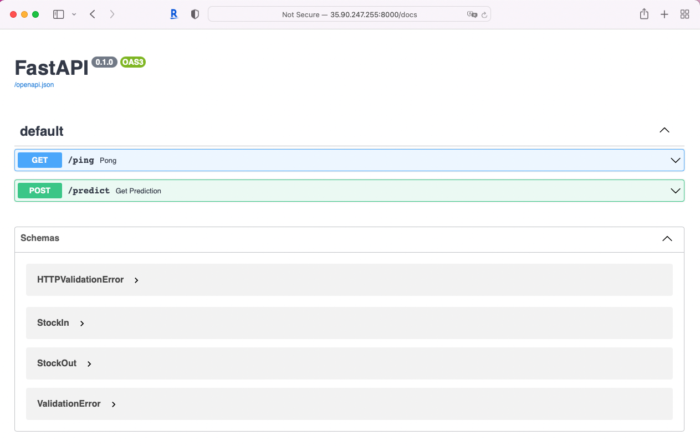
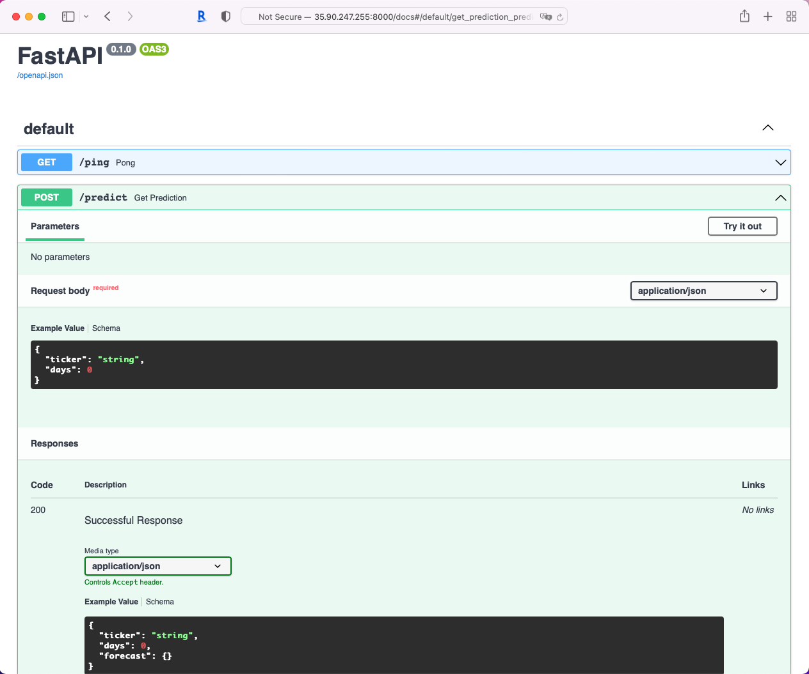
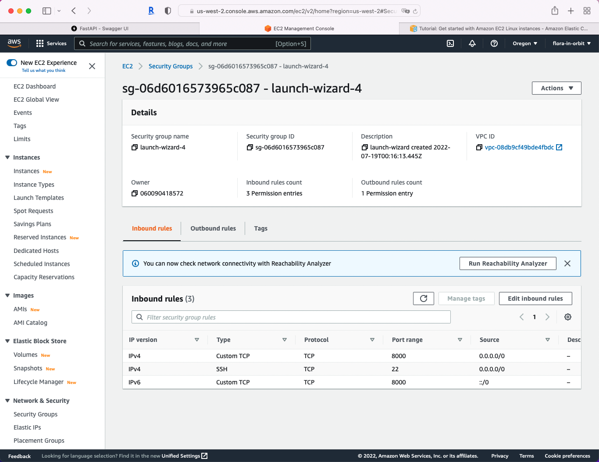

To access predictions from the API, execute this command from a terminal window on your local computer. Replace IP@ with the public IPv4 address of your EC2 instance.

```
curl \
--header "Content-Type: application/json" \
--request POST \
--data '{"ticker":"MSFT", "days":7}' \
http://52.32.56.182:8000/predict
```

You can also access the API documentation by using the public IPv4 address in this URL:
35.86.166.206:8000/docs

<p align="center">



</p>

<p align="center">

</p>
